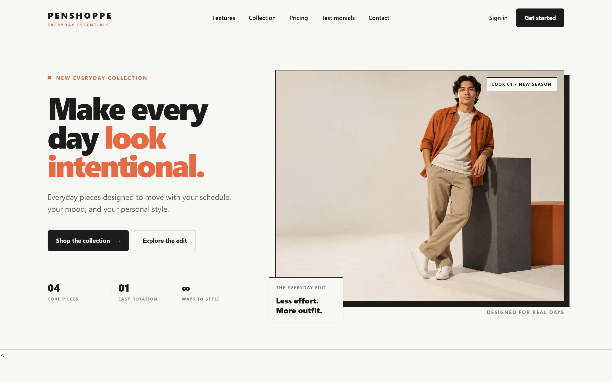
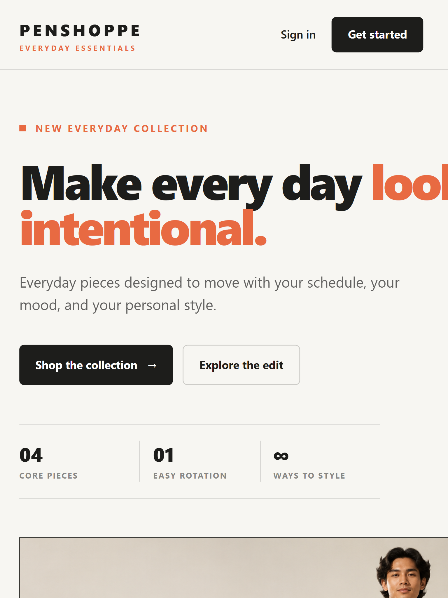
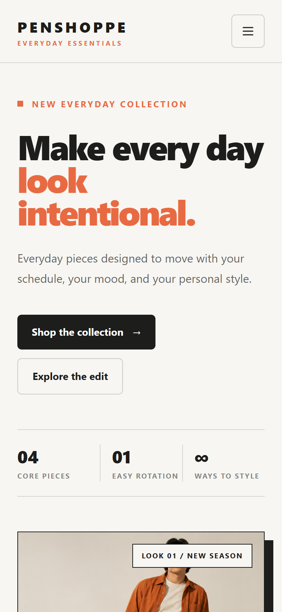

# Responsive Product Landing Page - Penshoppe Everyday Essentials

A responsive product landing page created using Laravel, Tailwind CSS, and reusable Blade Components.

> This is an educational concept project and is not affiliated with or endorsed by Penshoppe.

## 1. Introduction

A product landing page is a focused webpage created to present a product, service, or business to potential customers. It usually includes important information, product benefits, visual content, and calls to action that guide visitors toward a specific goal.

Landing pages are important for businesses because they create a strong first impression, communicate value clearly, improve customer engagement, and encourage visitors to take action.

For this project, a responsive landing page was created for Penshoppe Everyday Essentials, a clothing-store concept focused on everyday fashion pieces. The website presents clothing products, product benefits, pricing options, customer testimonials, and calls to action using a clean editorial design.

This project applies Laravel Blade Components, Tailwind CSS, responsive design principles, and UI/UX practices.

## 2. Objectives

This project aims to:

* Build a responsive product landing page using Laravel.
* Create reusable Blade Components.
* Apply Tailwind CSS utility classes.
* Implement responsive layouts for desktop, laptop, tablet, and mobile devices.
* Use Flexbox and CSS Grid for page structure.
* Apply consistent typography, spacing, colors, and visual hierarchy.
* Practice component-based frontend architecture.
* Document the project structure and reusable components.
* Publish a professional portfolio project through GitHub.

## 3. Project Sections

The landing page includes the following required sections:

### Navigation Bar

The navigation bar includes:

* Company branding
* Home link
* Features link
* Pricing link
* Testimonials link
* Contact link
* Sign In button
* Get Started button
* Responsive mobile menu

### Hero Section

The hero section includes:

* Product or brand name
* Catchy headline
* Short description
* Primary call-to-action button
* Secondary button
* Editorial fashion image
* Supporting product statistics

### Features Section

The page contains six feature highlights. Each feature includes:

* Icon
* Feature title
* Short description
* Supporting category or label

### Product Showcase

The product showcase presents the clothing collection through:

* Product visuals
* Collection preview
* Product cards
* Key product highlights
* Responsive product presentation

Because this project is based on a clothing business instead of a software product, the product showcase uses collection and product previews rather than a software dashboard.

### Pricing Section

The pricing section contains three plans. Each pricing card includes:

* Plan name
* Price
* Included features
* Call-to-action button

### Testimonials

The testimonials section contains three customer reviews. Each testimonial includes:

* Customer name
* Customer position or description
* Review
* Customer visual or supporting identity element

### Call-to-Action Section

The call-to-action section encourages users to:

* Explore the collection
* Start shopping
* Contact the business
* Discover more products

### Footer

The footer includes:

* Company information
* Quick links
* Product links
* Contact information
* Social media links
* Copyright information

## 4. Responsive Web Design

Responsive web design allows a website to adapt to different screen sizes and devices.

This project was tested using:

| Device  |   Viewport |
| ------- | ---------: |
| Desktop | 1440 x 900 |
| Tablet  | 768 x 1024 |
| Mobile  |  390 x 844 |

### Mobile-First Design

The page was designed to remain usable on smaller screens first. Content begins in a single-column layout and expands into multiple columns on larger screens.

Mobile-first decisions include:

* Collapsible navigation menu
* Stacked hero content
* Full-width buttons
* Single-column product cards
* Flexible image sizes
* Readable mobile typography

### Responsive Breakpoints

Tailwind CSS breakpoints were used to modify the layout at different screen sizes.

Examples include:

* `sm:` for small-screen adjustments
* `md:` for tablet layouts
* `lg:` for large desktop layouts
* `xl:` for wide-screen navigation behavior

### Flexbox

Flexbox was used for:

* Navigation alignment
* Button groups
* Header actions
* Footer content
* Product information alignment

Example:

```html
<div class="flex items-center justify-between gap-4">
    <span>Product information</span>
    <a href="#collection">Explore</a>
</div>
```

### CSS Grid

CSS Grid was used for:

* Hero layout
* Feature content
* Product cards
* Pricing cards
* Footer columns

Example:

```html
<section class="grid gap-10 lg:grid-cols-[0.8fr_1.2fr]">
    <div>Product visual</div>
    <div>Feature content</div>
</section>
```

### User Experience

The responsive design improves the user experience by:

* Making content easier to read
* Reducing unnecessary scrolling
* Keeping buttons accessible
* Making navigation easier on mobile
* Displaying product visuals clearly
* Maintaining consistent spacing
* Preventing content from overflowing horizontally

## 5. Tailwind CSS

Tailwind CSS is a utility-first CSS framework. Instead of writing large custom stylesheets, developers apply small utility classes directly to HTML elements.

### Advantages of Tailwind CSS

Tailwind CSS was useful in this project because it provides:

* Fast styling
* Consistent spacing
* Built-in responsive breakpoints
* Utility classes for layout
* Easy hover and focus states
* Reusable design patterns
* Less repeated CSS
* Faster UI iteration

### Responsive Utility Classes

Examples used in the project include:

```html
<div class="grid gap-6 sm:grid-cols-2 lg:grid-cols-3">
    ...
</div>
```

This creates:

* One column on small screens
* Two columns on medium screens
* Three columns on large screens

### Component Styling

Tailwind classes were used to style reusable components.

Example button:

```html
<a
    href="#collection"
    class="inline-flex items-center justify-center rounded-md bg-[#1d1d1b] px-6 py-3 font-semibold text-white transition hover:bg-[#ef6a45]"
>
    Shop the collection
</a>
```

The classes control:

* Layout
* Spacing
* Background color
* Text color
* Font weight
* Border radius
* Hover behavior
* Transition effects

## 6. Blade Components

Blade Components are reusable Laravel view components. They allow developers to separate repeated interface elements into organized files.

### Components Used

```text
resources/views/components/
├── button.blade.php
├── feature-card.blade.php
├── footer.blade.php
├── hero.blade.php
├── navbar.blade.php
├── pricing-card.blade.php
└── testimonial-card.blade.php
```

### Why Blade Components Are Useful

Blade Components improve the project by:

* Reducing duplicated HTML
* Making the code easier to maintain
* Separating sections into focused files
* Encouraging reusable design patterns
* Making future changes faster
* Keeping the main page easier to read

### Component Usage Example

The main page uses components like this:

```blade
<x-navbar />

<x-hero />

<x-feature-card
    number="01"
    title="Easy layers"
    description="Build everyday outfits from simple pieces that work together."
/>

<x-pricing-card />

<x-testimonial-card />

<x-footer />
```

### Component Architecture

The main page acts as the composition layer. Each Blade Component is responsible for rendering one reusable section of the interface.

This structure keeps the project modular and follows Laravel frontend organization practices.

## 7. User Interface Design

### Color Palette

The project uses a limited and harmonious color palette:

| Color        | Purpose                           |
| ------------ | --------------------------------- |
| Off-white    | Main background                   |
| Charcoal     | Main text and primary buttons     |
| Burnt orange | Accent color and highlighted text |
| Muted beige  | Product image backgrounds         |
| Soft gray    | Borders and secondary text        |

The color system avoids gradients and excessive visual effects to maintain a more intentional editorial style.

### Typography

Typography was designed to create a strong visual hierarchy.

The project uses:

* Large bold headings for the main message
* Smaller uppercase labels for section identification
* Medium-weight body text for descriptions
* Consistent letter spacing for editorial labels
* Responsive font sizes for different screens

### Iconography

Icons are used to support the meaning of each feature. They help users scan the content quickly without replacing the text description.

Icons are used for:

* Feature categories
* Navigation actions
* Product highlights
* Mobile navigation
* Footer links

### Button Styles

The page uses two main button styles:

#### Primary Button

The primary button uses a dark background and light text. It represents the main action, such as shopping or starting an experience.

#### Secondary Button

The secondary button uses a light background with a visible border. It represents supporting actions such as exploring the edit or viewing more information.

### Card Design

Cards use:

* Clear borders
* Consistent spacing
* Simple shadows where needed
* Structured typography
* Responsive widths
* Clear content hierarchy

The design avoids excessive rounded containers and unnecessary decoration.

### Layout Consistency

Consistency is maintained through:

* Repeated spacing values
* Shared button styles
* Consistent border colors
* Reusable Blade Components
* Repeated typography patterns
* Aligned section containers
* Consistent responsive behavior

## 8. Folder Structure

```text
week05-penshoppe-landing-page/
│
├── app/
│   ├── Http/
│   │   └── Controllers/
│   └── Models/
│
├── database/
│   ├── factories/
│   ├── migrations/
│   └── seeders/
│
├── documentation/
│   ├── before.png
│   └── after.png
│
├── public/
│   └── images/
│       ├── crossbody-bag.png
│       ├── essential-tee.png
│       ├── everyday-pants.png
│       └── hero-editorial.png
│
├── resources/
│   ├── css/
│   │   └── app.css
│   │
│   ├── js/
│   │   └── app.js
│   │
│   └── views/
│       ├── components/
│       │   ├── button.blade.php
│       │   ├── feature-card.blade.php
│       │   ├── footer.blade.php
│       │   ├── hero.blade.php
│       │   ├── navbar.blade.php
│       │   ├── pricing-card.blade.php
│       │   └── testimonial-card.blade.php
│       │
│       ├── layouts/
│       │   └── app.blade.php
│       │
│       └── pages/
│           └── home.blade.php
│
├── routes/
│   └── web.php
│
├── screenshots/
│   ├── before.png
│   ├── after.png
│   ├── desktop.png
│   ├── tablet.png
│   ├── mobile.png
│   ├── navbar.png
│   ├── hero.png
│   ├── features.png
│   ├── pricing.png
│   ├── testimonials.png
│   ├── footer.png
│   ├── vscode-structure.png
│   ├── blade-components.png
│   └── github-repository.png
│
├── tests/
├── artisan
├── composer.json
├── package.json
├── README.md
└── vite.config.js
```

### Folder Descriptions

| Folder                       | Purpose                                            |
| ---------------------------- | -------------------------------------------------- |
| `resources/views/layouts`    | Contains the main Blade layout                     |
| `resources/views/components` | Contains reusable Blade Components                 |
| `resources/views/pages`      | Contains complete page views                       |
| `public/images`              | Stores public product and editorial images         |
| `screenshots`                | Stores project evidence and responsive screenshots |
| `documentation`              | Stores before-and-after design comparisons         |
| `routes`                     | Contains Laravel route definitions                 |
| `resources/css`              | Contains application styles                        |
| `resources/js`               | Contains frontend JavaScript                       |

## 9. Screenshots

### Desktop View - 1440 x 900



### Tablet View - 768 x 1024



### Mobile View - 390 x 844



### Required Screenshot Files

The following screenshots should be added to the `screenshots` folder:

| Screenshot                | Filename                            |
| ------------------------- | ----------------------------------- |
| Before Design             | `screenshots/before.png`            |
| After Design              | `screenshots/after.png`             |
| Desktop Layout            | `screenshots/desktop.png`           |
| Tablet Layout             | `screenshots/tablet.png`            |
| Mobile Layout             | `screenshots/mobile.png`            |
| Navigation Bar            | `screenshots/navbar.png`            |
| Hero Section              | `screenshots/hero.png`              |
| Features Section          | `screenshots/features.png`          |
| Pricing Section           | `screenshots/pricing.png`           |
| Testimonials              | `screenshots/testimonials.png`      |
| Footer                    | `screenshots/footer.png`            |
| VS Code Project Structure | `screenshots/vscode-structure.png`  |
| Blade Components Folder   | `screenshots/blade-components.png`  |
| GitHub Repository         | `screenshots/github-repository.png` |

## 10. Before-and-After Comparison

The project documents the improvement from the early design to the final interface.

### Before

The early design used a simpler feature layout with less visual content and weaker product presentation.

### After

The final design includes:

* Stronger visual hierarchy
* Original product imagery
* Improved feature presentation
* More intentional spacing
* Responsive layouts
* Clearer buttons
* Better product storytelling
* More complete sections
* Improved mobile usability

The comparison files should be stored in:

```text
documentation/before.png
documentation/after.png
```

## 11. Problems Encountered and Solutions

### Problem 1: The initial feature section looked empty

The first version used a basic grid with too much unused space.

**Solution:** The feature area was redesigned using a stronger editorial layout with a large product visual and structured feature rows.

### Problem 2: Tablet navigation needed improvement

At tablet widths, desktop navigation links could disappear while desktop action buttons remained visible.

**Solution:** The navigation breakpoints were adjusted so tablet users receive the mobile navigation pattern instead of an incomplete desktop header.

### Problem 3: Hero typography was too large on tablet

The hero heading could become too large and affect the layout at tablet widths.

**Solution:** Responsive typography was adjusted so the hero heading scales more appropriately between tablet and desktop layouts.

### Problem 4: The JavaScript file returned a server error

The fresh Laravel setup did not contain the expected default Bootstrap import.

**Solution:** The unnecessary Bootstrap import was removed and the mobile menu JavaScript was kept as a simple local script.

### Problem 5: Screenshot filenames contained duplicate extensions

The screenshots were initially saved as files such as `desktop.png.png`.

**Solution:** The files were renamed to:

```text
desktop.png
tablet.png
mobile.png
```

This allowed the README image paths to work correctly.

## 12. Installation

### Requirements

* PHP 8.2 or higher
* Composer
* Node.js
* npm
* Git

### Clone the Repository

```bash
git clone https://github.com/JoshuaLlanto/week05-product-landing-page.git
cd week05-product-landing-page
```

### Install Dependencies

```bash
composer install
npm install
```

### Configure Laravel

For Windows PowerShell:

```powershell
Copy-Item .env.example .env
php artisan key:generate
```

For macOS or Linux:

```bash
cp .env.example .env
php artisan key:generate
```

### Run the Project

```bash
composer run dev
```

Open the project at:

```text
http://127.0.0.1:8000
```

### Build the Frontend

```bash
npm run build
```

## 13. Development Commands

| Command                      | Purpose                                       |
| ---------------------------- | --------------------------------------------- |
| `composer install`           | Installs Laravel dependencies                 |
| `npm install`                | Installs frontend dependencies                |
| `composer run dev`           | Starts Laravel and Vite development processes |
| `php artisan serve`          | Starts the Laravel server                     |
| `npm run dev`                | Starts the Vite development server            |
| `npm run build`              | Builds optimized frontend assets              |
| `php artisan route:list`     | Displays registered routes                    |
| `php artisan view:clear`     | Clears compiled Blade views                   |
| `php artisan optimize:clear` | Clears Laravel caches                         |

## 14. GitHub Repository

Repository name:

```text
week05-product-landing-page
```

Repository URL:

[View the GitHub Repository](https://github.com/JoshuaLlanto/week05-product-landing-page)

The repository must remain public for grading and portfolio purposes.

The activity requires a minimum of ten meaningful Git commits. Commit messages should describe actual project milestones, such as:

```text
feat: create landing page layout
feat: build responsive navbar
feat: create reusable hero component
feat: build feature cards
feat: implement pricing section
feat: add testimonials
style: improve responsive spacing
refactor: organize Blade components
docs: complete README documentation
docs: upload project screenshots
```

## 15. LinkedIn Portfolio Activity

The LinkedIn post should include:

* A short project overview
* Skills learned
* Before-and-after screenshots
* GitHub repository link
* A short reflection

Suggested skills to mention:

* Laravel
* Tailwind CSS
* Blade Components
* Responsive Design
* UI/UX Design
* Git and GitHub

## 16. Reflection

This activity improved my understanding of responsive frontend development using Laravel, Tailwind CSS, and Blade Components. I learned how reusable components can reduce duplicated code and make a project easier to maintain.

I also learned that responsive design is not only about making a page smaller. It requires adjusting navigation, typography, spacing, image sizes, and content structure so the interface remains usable on every device.

## 17. Scope and Limitations

This project is a static product landing page created for an academic Laravel activity.

It does not include:

* User authentication
* Shopping cart functionality
* Checkout processing
* Database integration
* Payment processing
* Product management
* Order management
* Native Android or iOS application features

The buttons and navigation links demonstrate the landing-page flow and section structure.

## 18. Academic Submission Checklist

Before submitting, verify the following:

* Responsive landing page completed
* All required sections implemented
* Blade Components created and reused
* Tailwind CSS used throughout the project
* Desktop layout tested
* Laptop layout tested
* Tablet layout tested
* Mobile layout tested
* Public GitHub repository created
* Minimum of ten meaningful Git commits completed
* Complete README documentation added
* Before-and-after comparison included
* Screenshots folder completed
* LinkedIn portfolio post published
* Repository link submitted through the LMS

