# Responsive Product Landing Page - Penshoppe Everyday Essentials

A modern and responsive product landing page built with Laravel, Tailwind CSS, and reusable Blade Components.

> This is an educational concept project and is not affiliated with or endorsed by Penshoppe.

## 1. Introduction

A product landing page is a focused webpage that introduces a product, service, or business and guides visitors toward actions such as exploring products, registering, contacting the business, or making a purchase.

Landing pages are important because they create a strong first impression, explain the value of a product clearly, improve customer engagement, and help businesses convert visitors into potential customers.

This project transforms the information and visual identity of an existing clothing business into a clean, responsive, and professional landing page. Penshoppe Everyday Essentials presents clothing products through an editorial layout with clear navigation, product imagery, feature highlights, pricing cards, testimonials, and calls to action.

## 2. Objectives

- Build a responsive interface using Tailwind CSS.
- Create reusable Laravel Blade Components.
- Reduce duplicated markup through component-based development.
- Apply mobile-first responsive design principles.
- Use Flexbox and CSS Grid for page layouts.
- Maintain consistent typography, spacing, colors, and visual hierarchy.
- Organize frontend files using Laravel best practices.
- Document the project's responsive design and component architecture.
- Publish the finished project through GitHub and LinkedIn.

## 3. Implemented Sections

### Navigation Bar

- Company branding
- Home link
- Features link
- Pricing link
- Testimonials link
- Contact link
- Sign In button
- Get Started button
- Responsive mobile menu

### Hero Section

- Product name
- Catchy headline
- Short product description
- Primary call-to-action button
- Secondary call-to-action button
- Editorial product image
- Supporting product statistics

### Features Section

The landing page contains six feature highlights. Each feature includes an icon, title, and short description.

### Product Showcase

Because this project represents a clothing business, the product showcase uses collection previews, product cards, product imagery, mobile-ready layouts, and key product highlights instead of a software dashboard.

### Pricing Section

The page contains three pricing plans with plan names, prices, included features, and action buttons.

### Testimonials

The page contains three customer testimonials with customer identity details and reviews.

### Call-to-Action Section

The call-to-action section encourages visitors to explore the collection, begin shopping, or contact the business.

### Footer

The footer includes company information, quick links, contact details, social media links, and copyright information.

## 4. Responsive Web Design

Responsive web design allows a website to adapt to different devices and viewport sizes. It is important because users may visit the website using desktop computers, laptops, tablets, or mobile phones.

A responsive interface keeps content readable, navigation accessible, images properly scaled, and actions easy to use on every device.

### Tested Viewports

| Device | Viewport | Main Behavior |
|---|---:|---|
| Desktop | 1440 x 900 | Full navigation and split hero layout |
| Tablet | 768 x 1024 | Compact navigation and stacked content |
| Mobile | 390 x 844 | Mobile menu and single-column layout |

### Mobile-First Design

The interface begins with a mobile-friendly single-column structure. Larger layouts are introduced through responsive Tailwind breakpoints.

Mobile-first decisions include:

- Collapsible navigation
- Stacked hero content
- Responsive buttons
- Flexible product images
- Single-column cards
- Readable mobile typography
- Touch-friendly navigation controls

### Responsive Breakpoints

The project uses Tailwind prefixes such as `sm:`, `md:`, `lg:`, and `xl:` to modify layouts and typography at different viewport widths.

### Flexbox

Flexbox is used for navigation alignment, button groups, product details, header actions, and footer links.

```html
<div class="flex items-center justify-between gap-4">
    <span>Product information</span>
    <a href="#collection">Explore collection</a>
</div>
```

### CSS Grid

CSS Grid is used for the hero layout, product cards, feature section, pricing cards, testimonials, and footer columns.

```html
<section class="grid gap-10 lg:grid-cols-[0.8fr_1.2fr]">
    <div>Product visual</div>
    <div>Feature content</div>
</section>
```

### User Experience

The responsive design improves usability by:

- Maintaining readable typography
- Keeping buttons easy to access
- Providing appropriate spacing
- Displaying product visuals clearly
- Simplifying mobile navigation
- Preventing horizontal overflow
- Maintaining consistent layouts

## 5. Tailwind CSS

Tailwind CSS is a utility-first CSS framework. Instead of writing a separate CSS rule for every element, developers combine small utility classes directly in the markup.

### Advantages of Tailwind CSS

Tailwind CSS was useful in this project because it provides:

- Faster interface development
- Consistent spacing and sizing
- Built-in responsive breakpoints
- Reusable visual patterns
- Easy hover and focus states
- Less duplicated CSS
- Faster design adjustments

### Responsive Utility Example

```html
<div class="grid gap-6 sm:grid-cols-2 lg:grid-cols-3">
    <!-- Responsive cards -->
</div>
```

This displays one column on small screens, two columns on medium screens, and three columns on large screens.

### Component Styling Example

```html
<a
    href="#collection"
    class="inline-flex items-center justify-center rounded-md bg-[#1d1d1b] px-6 py-3 font-semibold text-white transition hover:bg-[#ef6a45]"
>
    Shop the collection
</a>
```

Tailwind utilities are used throughout the project for:

- Grid
- Flexbox
- Spacing
- Responsive visibility
- Typography
- Colors
- Borders
- Shadows
- Rounded corners
- Hover effects
- Focus states

## 6. Blade Components

Blade Components are reusable Laravel view files that package repeated interface elements into organized components.

They improve maintainability because a component can be updated in one file instead of changing repeated markup throughout the page.

### Components

| Component | Purpose |
|---|---|
| `navbar.blade.php` | Responsive navigation bar |
| `hero.blade.php` | Main hero presentation |
| `button.blade.php` | Reusable button styles |
| `feature-card.blade.php` | Individual feature item |
| `pricing-card.blade.php` | Pricing plan card |
| `testimonial-card.blade.php` | Customer testimonial card |
| `footer.blade.php` | Website footer |

### Benefits of Modular UI Development

- Reduces duplicated code
- Improves readability
- Keeps the page organized
- Makes components reusable
- Simplifies future design updates
- Separates component structure from page composition

### Blade Component Example

```blade
<x-navbar />

<x-hero />

<x-feature-card
    number="01"
    title="Easy layers"
    description="Build everyday outfits from simple pieces that work together."
/>

<x-footer />
```

### Blade Components Folder

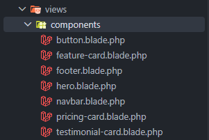

## 7. User Interface Design

### Color Palette

| Color | Purpose |
|---|---|
| Off-white | Main background |
| Charcoal | Primary text and buttons |
| Burnt orange | Accent text and visual emphasis |
| Muted beige | Product-image backgrounds |
| Soft gray | Borders and secondary text |

The limited palette creates a consistent fashion-editorial identity. Gradients and unnecessary visual effects were avoided to keep the design intentional and professional.

### Typography

Large bold headings establish visual hierarchy. Smaller uppercase labels identify sections, while readable body text supports product information.

Responsive font sizes prevent headings from becoming too large on tablet and mobile screens.

### Iconography

Simple icons support feature descriptions and navigation actions. Icons are paired with text so their meaning remains clear.

### Button Styles

Primary buttons use a dark background with light text to emphasize the main action.

Secondary buttons use a light background and visible border for supporting actions.

### Card Design

Cards use:

- Consistent spacing
- Visible borders
- Controlled shadows
- Structured typography
- Responsive widths
- Clear information hierarchy

Excessive rounded containers and unnecessary decorative effects were avoided.

### Layout Consistency

Consistency is maintained through:

- Shared section containers
- Repeated spacing values
- Consistent border colors
- Reusable typography patterns
- Shared button styles
- Reusable Blade Components
- Consistent responsive behavior

## 8. Folder Structure

```text
week05-penshoppe-landing-page/
|
|-- documentation/
|   |-- before.png
|   `-- after.png
|
|-- public/
|   `-- images/
|       |-- crossbody-bag.png
|       |-- essential-tee.png
|       |-- everyday-pants.png
|       `-- hero-editorial.png
|
|-- resources/
|   |-- css/
|   |   `-- app.css
|   |-- js/
|   |   `-- app.js
|   `-- views/
|       |-- layouts/
|       |   `-- app.blade.php
|       |-- components/
|       |   |-- button.blade.php
|       |   |-- feature-card.blade.php
|       |   |-- footer.blade.php
|       |   |-- hero.blade.php
|       |   |-- navbar.blade.php
|       |   |-- pricing-card.blade.php
|       |   `-- testimonial-card.blade.php
|       `-- pages/
|           `-- home.blade.php
|
|-- routes/
|   `-- web.php
|
|-- screenshots/
|   |-- desktop.png
|   |-- tablet.png
|   |-- mobile.png
|   |-- navbar.png
|   |-- hero.png
|   |-- features.png
|   |-- product-showcase.png
|   |-- pricing.png
|   |-- testimonials.png
|   |-- footer.png
|   |-- vscode-structure.png
|   |-- blade-components.png
|   `-- github-repository.png
|
|-- README.md
|-- composer.json
|-- package.json
`-- vite.config.js
```

### Folder Purposes

| Folder | Purpose |
|---|---|
| `resources/views/layouts` | Contains the shared application layout |
| `resources/views/components` | Contains reusable Blade Components |
| `resources/views/pages` | Contains complete page views |
| `public` | Contains publicly accessible images and generated assets |
| `screenshots` | Contains responsive and project-evidence screenshots |
| `documentation` | Contains the before-and-after design comparison |

## 9. Screenshots

### Desktop View - 1440 x 900


### Tablet View - 768 x 1024


### Mobile View - 390 x 844


### Navigation Bar

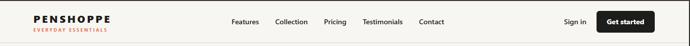

### Hero Section

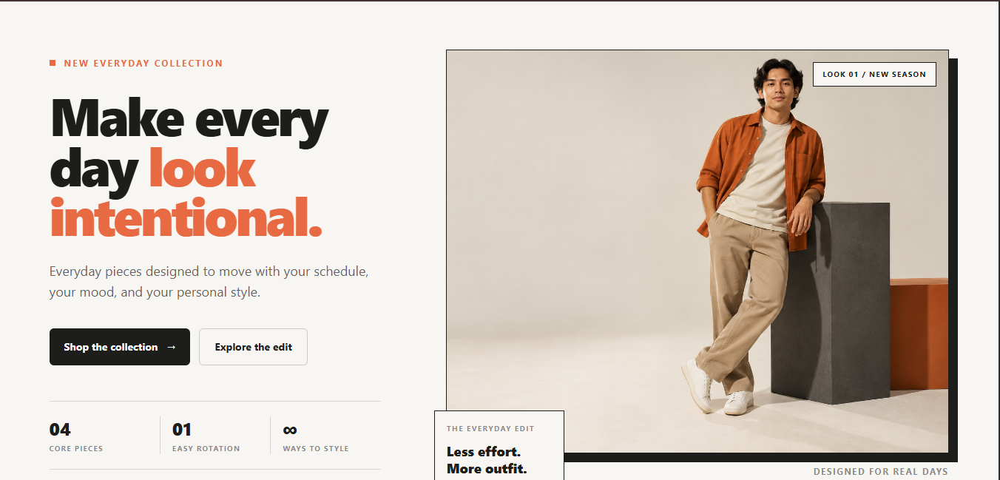

### Features Section


### Product Showcase

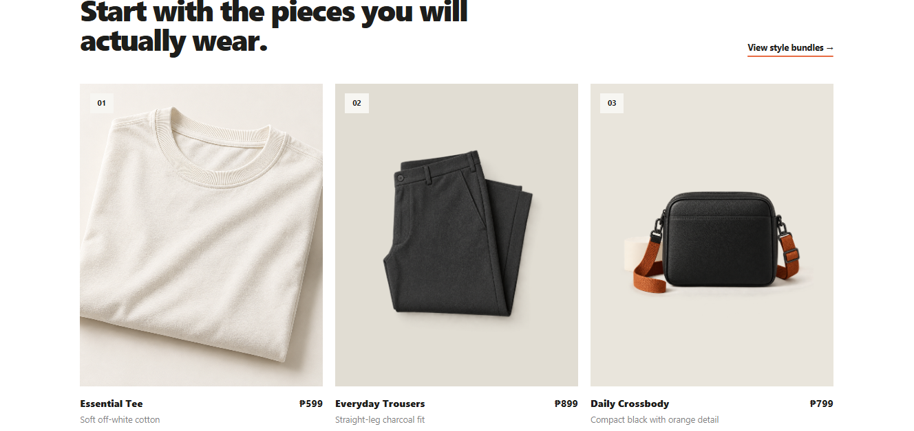

### Pricing Section

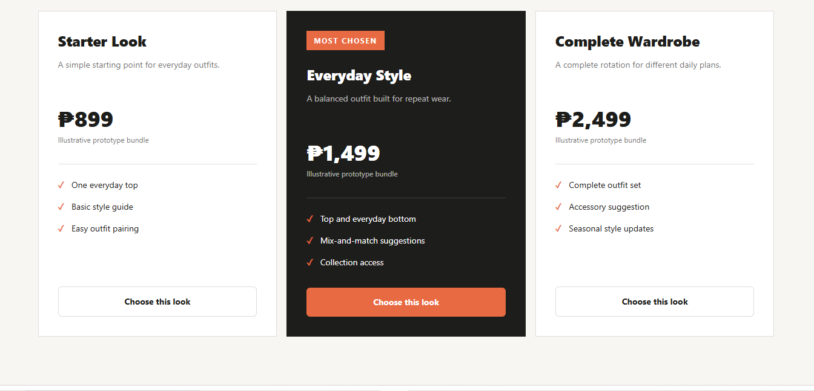

### Testimonials

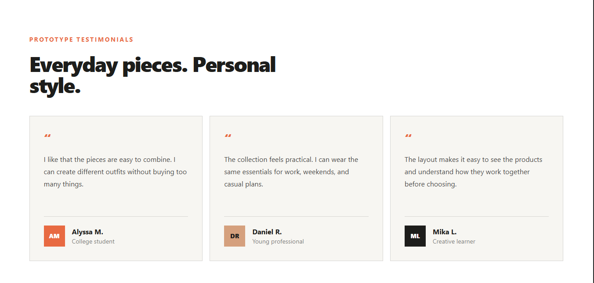

### Footer

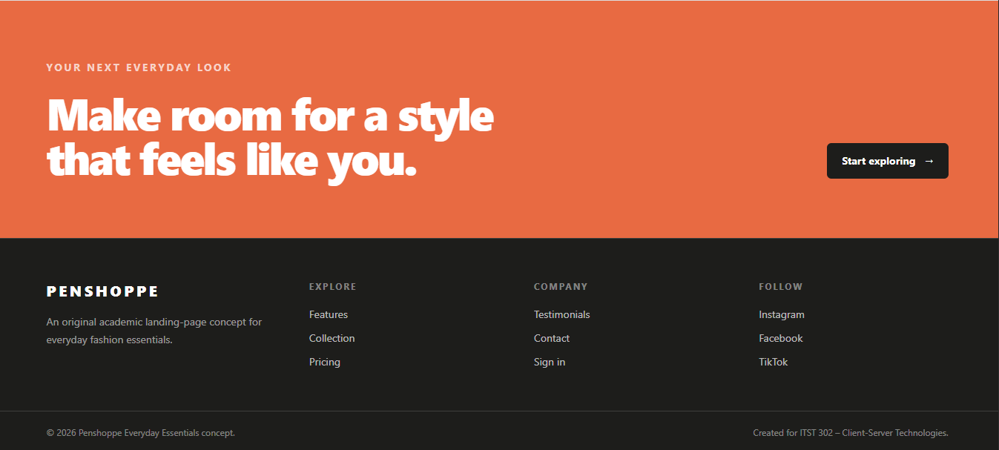

### VS Code Project Structure

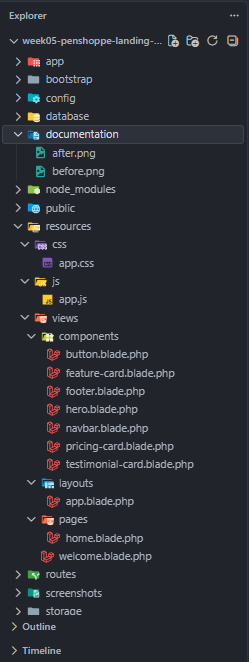

### Blade Components Folder


### GitHub Repository

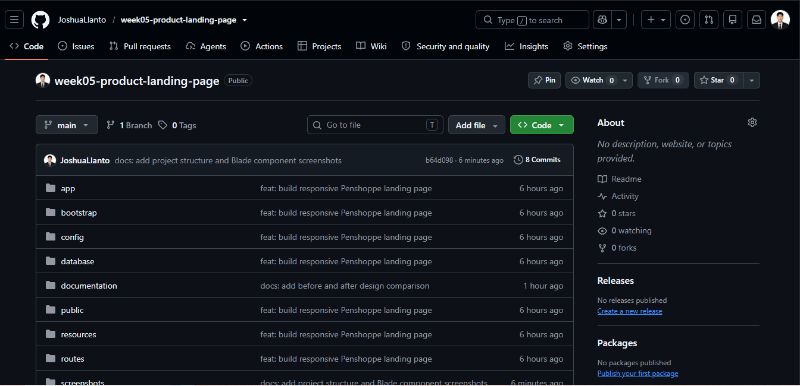

## 10. Before-and-After Comparison

### Before Design

The early feature section used a basic card grid with limited imagery, excessive unused space, and weaker visual hierarchy.

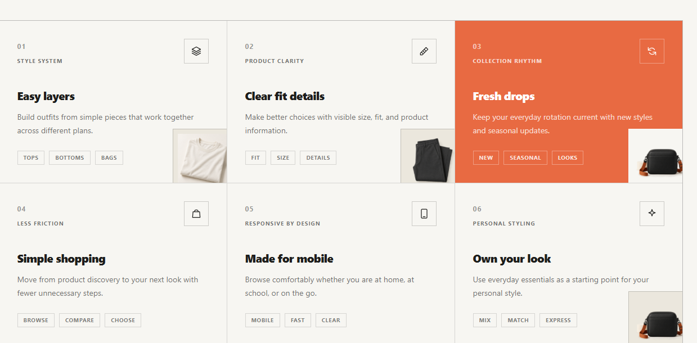

### After Design

The improved feature section uses a stronger editorial composition, larger product imagery, clearer typography, better spacing, and structured feature content.

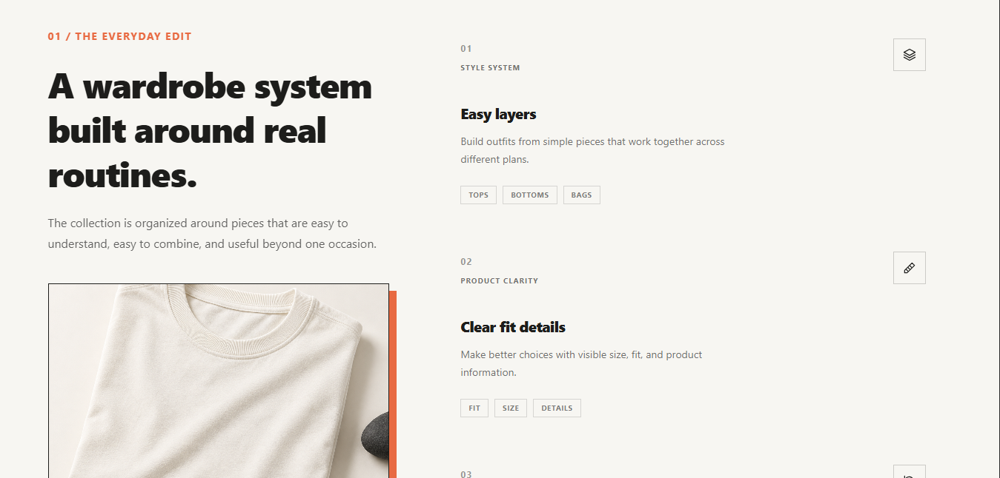

### Improvements Made

- Added stronger product imagery
- Improved visual hierarchy
- Improved spacing and alignment
- Organized feature information more clearly
- Improved responsive typography
- Created a more professional editorial layout
- Improved overall usability

## 11. Problems Encountered and Solutions

### Initial Feature Section Looked Empty

The original feature grid contained too much unused space and weak product presentation.

**Solution:** The feature area was redesigned as an editorial two-column section with a large product visual and structured feature rows.

### Tablet Navigation Needed Improvement

Desktop navigation controls did not fit comfortably at tablet widths.

**Solution:** The breakpoint behavior was adjusted so tablets use the compact navigation pattern.

### Hero Typography Was Too Large on Tablet

The hero heading became too large at some tablet widths.

**Solution:** Responsive heading sizes were refined to preserve readability and prevent awkward wrapping.

### JavaScript Returned a Server Error

The fresh Laravel setup did not include the expected default Bootstrap module.

**Solution:** The unnecessary Bootstrap import was removed, leaving the mobile-navigation script required by the page.

### Screenshot Filenames Had Duplicate Extensions

The screenshots were initially saved with names such as `desktop.png.png`.

**Solution:** They were renamed to `desktop.png`, `tablet.png`, and `mobile.png` so the README image paths would work correctly.

## 12. Installation

### Requirements

- PHP 8.2 or higher
- Composer
- Node.js and npm
- Git

### Clone the Repository

```bash
git clone https://github.com/JoshuaLlanto/week05-product-landing-page.git
cd week05-product-landing-page
```

### Install Dependencies

```bash
composer install
npm install
```

### Configure Laravel

For Windows PowerShell:

```powershell
Copy-Item .env.example .env
php artisan key:generate
```

For macOS or Linux:

```bash
cp .env.example .env
php artisan key:generate
```

### Run the Project

```bash
composer run dev
```

Open the application at:

```text
http://127.0.0.1:8000
```

### Production Build

```bash
npm run build
```

## 13. GitHub Repository

Repository name:

```text
week05-product-landing-page
```

Repository link:

[week05-product-landing-page](https://github.com/JoshuaLlanto/week05-product-landing-page)

The repository is public and uses meaningful commits to document implementation, responsive improvements, screenshots, and technical documentation.

## 14. LinkedIn Portfolio Activity

The LinkedIn portfolio post should include:

- A short project overview
- Skills learned
- Before-and-after screenshots
- GitHub repository link
- A short reflection

Skills demonstrated:

- Laravel
- Tailwind CSS
- Blade Components
- Responsive Design
- UI/UX Design
- Git and GitHub

## 15. Reflection

This activity improved my understanding of responsive frontend development using Laravel, Tailwind CSS, and Blade Components. I learned how reusable components reduce repeated code and make a project easier to organize and maintain.

I also learned that responsive design involves more than reducing the size of a desktop page. Navigation, typography, spacing, images, cards, and content structure must all adjust so the interface remains usable on different devices.

## 16. Scope and Limitations

This project is a responsive landing page created for an academic Laravel activity.

It does not include:

- User authentication
- Shopping-cart functionality
- Checkout processing
- Payment processing
- Order management
- Database integration
- Native Android or iOS application features

## 17. Submission Checklist

Before submitting, verify the following:

- Responsive landing page completed
- All required sections implemented
- Blade Components created and reused
- Tailwind CSS used throughout the project
- Desktop layout tested
- Laptop layout tested
- Tablet layout tested
- Mobile layout tested
- Public GitHub repository created
- Minimum of ten meaningful Git commits completed
- Complete README documentation added
- Before-and-after comparison included
- Screenshots folder completed
- LinkedIn portfolio post published
- GitHub repository link submitted through the LMS

## Author

**Joshua B. Llanto**

Bachelor of Science in Information Technology

## License

This project was created for educational and academic purposes.